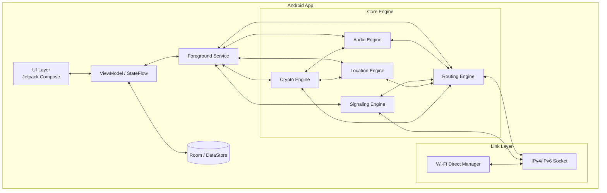

# OffGrid 技术架构设计

> 架构设计文档 v1.3
> 设计：pro-general-architect（构师）
> 输入：`docs/PRD.md` v1.1

---

## 1. 设计输入

### 1.1 来自 PRD 的核心约束

| 维度 | 约束 |
|------|------|
| 平台 | **Android 12+** |
| 组网 | **Wi-Fi Direct 唯一组网方式**（不含蓝牙组网） |
| 语音 | **全双工** 实时群聊 |
| 位置 | 相对方位 + 距离（无需地图坐标） |
| 开源 | **MIT** 协议 |
| 团队规模 | 2-5 人为主，可扩展至 10 人左右 |
| 周期 | 3-6 个月 |

### 1.2 关键非功能目标
- 单跳距离 ≥ 100m（开阔地 Wi-Fi Direct）
- 端到端延迟：单跳 < 300ms
- **MVP 支持单跳直连；多跳中继作为远期目标，依赖设备 AP-STA 并发能力**
- 后台持续运行，锁屏仍可接收语音
- 纯离线、无服务器、无账号

---

## 2. 架构目标与原则

1. **去中心化**：无单点故障，任一节点退出不影响整体网络（在拓扑允许范围内）。
2. **低开销**：语音码率控制在 16-32 kbps，控制面消息极简。
3. **可演进**：MVP 先支持受控泛洪，后续可平滑升级为链路状态路由。
4. **Android 原生**：尽量使用 Android 官方 API，降低兼容性与 root 依赖。
5. **MIT 开源**：所有依赖与自研代码需兼容 MIT 或宽松协议。

---

## 3. 备选方案对比

### 方案 A：Wi-Fi Direct + 自定义 UDP Mesh（推荐）
基于 Android Wi-Fi Direct 建立邻居链路，使用 **IPv4 私有地址（192.168.49.x）** 作为默认传输地址，并保留 IPv6 link-local 作为可选回退，自定义轻量级路由与语音传输协议。

| 维度 | 评估 |
|------|------|
| 优点 | 完全自主可控；针对语音场景优化；无外部重型依赖；多跳可扩展（受硬件并发能力限制） |
| 缺点 | 需自行处理 Wi-Fi Direct 组管理、IP 冲突、后台保活等复杂逻辑；MVP 先落地单跳 |
| 成熟度 | 有 Meshrabiya、Serval、Qaul 等可参考 |
| 适用性 | ⭐⭐⭐⭐⭐ 高度匹配 |

### 方案 B：WebRTC over Mesh Underlay
底层仍用 Wi-Fi Direct 建立 mesh 链路，上层跑 WebRTC PeerConnection 实现语音。

| 维度 | 评估 |
|------|------|
| 优点 | 音频处理（Opus、回声消除、抖动缓冲）成熟；加密内置 |
| 缺点 | WebRTC 初始握手重，多跳转发 WebRTC 数据包复杂；原生 Android 集成体积大；全双工群聊需 SFU/MCU 逻辑，与去中心化冲突 |
| 成熟度 | WebRTC 成熟，但“多跳 WebRTC mesh”非典型用法 |
| 适用性 | ⭐⭐⭐ 适合直连 1:1，不适合本项目多跳群聊 |

### 方案 C：Local Hotspot + BATMAN-Adv
利用 Android 本地热点，运行 Linux BATMAN-Adv 内核模块做 mesh 路由。

| 维度 | 评估 |
|------|------|
| 优点 | BATMAN-Adv 是成熟 mesh 路由协议 |
| 缺点 | **需要 root 或自定义 ROM**；Android 12+ 热点 API 仍受限；与项目目标冲突 |
| 成熟度 | 高，但不可行 |
| 适用性 | ⭐ 不推荐 |

### 方案 D：直接复用 Meshrabiya 库
基于 UstadMobile 的 Meshrabiya 开源库构建上层语音与应用。

| 维度 | 评估 |
|------|------|
| 优点 | 已解决 Wi-Fi Direct mesh、IPv6 link-local、AP-STA 并发等底层难题 |
| 缺点 | 库相对小众，文档与社区活跃度有限；协议与接口未必完全匹配语音场景 |
| 成熟度 | 中等 |
| 适用性 | ⭐⭐⭐⭐ 可作为底层参考或集成候选 |

### 推荐结论
**推荐方案 A（自定义 UDP Mesh）作为主体架构**，MVP 先实现 **单跳直连**，链路层以 **IPv4 私有地址** 为主；多跳与 IPv6 link-local 作为后续扩展，参考 **Meshrabiya** 的 AP-STA 并发思路；**WebRTC 与 BATMAN-Adv 不推荐用于首期**。

---

## 4. 推荐方案：总体架构

### 4.1 分层架构图



### 4.2 数据流（语音为例）

```
麦克风 → AudioRecord → Opus 编码 → 加密(ChaCha20-Poly1305)
       → Mesh 包头 → UDP Socket → Wi-Fi Direct → 邻居节点
       → 路由引擎判断：本地播放 / 继续转发
       → 解密 → Opus 解码 → AudioTrack → 耳机/扬声器
```

### 4.3 部署拓扑

```
**MVP 单跳场景（所有 Android 12+ 设备均可支持）：**

```
[Node A] ←→ [Node B] ←→ [Node C]
   GO          Client       Client
```

A 作为 Group Owner，B、C 作为 Client，所有节点在同一 Wi-Fi Direct Group 内直连通信。

**远期多跳场景（依赖 AP-STA 并发，需硬件支持）：**

```
[Node A] ←→ [Node B] ←→ [Node C] ←→ [Node D]
   GO        Client/GO      Client/GO      Client
```

A 与 D 超出直连范围，B、C 同时作为 Client 与 Group Owner，
自动转发语音包，实现多跳中继。该模式仅在实测支持并发的机型上启用。
```

---

## 5. 模块划分与职责

### 5.1 模块总览

| 模块 | 包名 | 职责 | 当前状态 |
|------|------|------|----------|
| UI | `ui.*` | Jetpack Compose 页面、主题、导航 | 已实现 |
| ViewModel | `ui.screens.*ViewModel` | 业务状态管理、用户交互 | 已实现 |
| Foreground Service | `service.*` | 保活、权限维持、引擎生命周期 | 已实现 |
| Audio Engine | `audio.*` | 采集、播放、Opus 编解码 | 已实现；VAD / 软件 AEC 为远期优化 |
| Mesh Link | `link.*` | Wi-Fi Direct 组管理、UDP 邻居发现、IPv4 地址适配 | 已实现；IPv6 link-local 为可选扩展 |
| Routing Engine | `link.LinkManager`、`link.neighbor.NeighborTable` | 包转发、TTL/去重、邻居老化 | 已实现单跳广播；多跳转发为远期扩展 |
| Signaling Engine | `link.signal.SignalingEngine` | 节点发现、心跳、会话管理 | 已实现 |
| Location Engine | `link.location.*` | GPS 获取、相对方位/距离计算、位置广播 | 已实现；当前使用 `LocationManager` |
| Crypto Engine | `security.*` | 密钥生成、交换、加解密 | **未实现**；MVP 为明文传输 |
| Data | `data.*` | Repository、Room、DataStore | **未实现**；当前使用轻量 SharedPreferences |
| Common | `util.*`、`link.MeshConstants` | 常量、工具类、日志 | 已实现 |

> 注：包名以 `app/src/main/java/com/offgrid/app/` 下的实际目录为准；架构文档中部分模块（Crypto、Data）为远期设计，当前尚未落地。

### 5.2 关键模块详细说明

#### 5.2.1 Audio Engine
- **AudioRecord**：16 kHz / 16-bit / 单声道，20ms 采样周期
- **Opus 编码**：普通模式 24 kbps，省电模式 12 kbps；复杂度 5 / 3
- **AudioTrack**：输出到当前音频设备（扬声器 / 有线耳机 / 蓝牙耳机，由 `AudioRouter` 切换）
- **VAD / Jitter Buffer / 软件 AEC**：尚未实现，列为后续优化

#### 5.2.2 Mesh Link Layer
- **Wi-Fi Direct Manager**：
  - 调用 `WifiP2pManager` 进行 discoverPeers / connect / createGroup
  - 监听 `WIFI_P2P_CONNECTION_CHANGED_ACTION`、`WIFI_P2P_THIS_DEVICE_CHANGED_ACTION`
- **Group 策略**：
  - **MVP**：单 Group Owner + 多 Client 的星型拓扑，所有节点在同一 Wi-Fi Direct Group 内直连。
  - **远期**：若设备支持 **AP-STA 并发**，可扩展为链式/网状拓扑；不支持则保持单跳。
- **IP 地址**：
  - **默认使用 IPv4 私有地址（192.168.49.x）**，与 Android Wi-Fi Direct 默认 DHCP 分配保持一致。
  - **保留 IPv6 link-local（fe80::/64）作为可选回退**，在分配了 IPv6 地址的机型上可用。
- **Neighbor Table**：维护 `<NodeID, IPv4|IPv6, Role, RSSI, LastSeen>`

#### 5.2.3 Routing Engine
- **MVP 策略：受控泛洪（Controlled Flooding）**
  - 每个包携带：SourceID、SeqNo、TTL
  - 节点记录已转发包的 `(SourceID, SeqNo)`，避免重复转发
  - 每收到一个包：TTL--，若 TTL > 0 且非重复，则向除入接口外的所有邻居转发
  - 目的地为本机则提交上层
- **未来演进**：链路状态路由（Link-State），每个节点维护全局拓扑，按最短路径转发

#### 5.2.4 Signaling Engine
- **节点发现**：周期性发送 HELLO 广播，携带 NodeID、公钥指纹、能力位
- **心跳**：每 3-5 秒一次，用于链路活性检测
- **拓扑维护**：基于 HELLO 构建本地邻居表，泛洪拓扑信息（可选）
- **会话管理**：语音会话无需显式建立，开机即默认加入群组通话；未来可支持私密频道

#### 5.2.5 Location Engine
- **位置获取**：`LocationManager`（GPS + network provider），默认 1 秒刷新一次；省电模式下延长至 5 秒
- **广播**：将 WGS-84 坐标打包进 LOCATION 包，通过 UDP 广播
- **相对计算**：接收方使用 Haversine 公式计算距离，用方位角公式计算相对方位
- **UI 显示**：罗盘式界面，显示队友方向与距离

#### 5.2.6 Crypto Engine
- **密钥**：首次启动生成 X25519 密钥对（使用 libsodium 或 BouncyCastle）
- **信任模型**：MVP 采用“同一局域网即信任”模型，公钥在 HELLO 中交换
- **加密**：语音与位置包使用 ChaCha20-Poly1305 加密
- **防重放**：结合 SeqNo 与时间戳

---

## 6. 接口与数据格式

### 6.1 Mesh 包格式（二进制）

```
 0                   1                   2                   3
 0 1 2 3 4 5 6 7 8 9 0 1 2 3 4 5 6 7 8 9 0 1 2 3 4 5 6 7 8 9 0 1
+-+-+-+-+-+-+-+-+-+-+-+-+-+-+-+-+-+-+-+-+-+-+-+-+-+-+-+-+-+-+-+-+
| Version (1)   | Packet Type   | TTL           | Flags         |
+-+-+-+-+-+-+-+-+-+-+-+-+-+-+-+-+-+-+-+-+-+-+-+-+-+-+-+-+-+-+-+-+
|                         Source Node ID                        |
|                       (8 bytes, uint64)                       |
+-+-+-+-+-+-+-+-+-+-+-+-+-+-+-+-+-+-+-+-+-+-+-+-+-+-+-+-+-+-+-+-+
|                      Destination Node ID                      |
|                       (8 bytes, uint64)                       |
|                    (0xFFFFFFFFFFFFFFFF = broadcast)             |
+-+-+-+-+-+-+-+-+-+-+-+-+-+-+-+-+-+-+-+-+-+-+-+-+-+-+-+-+-+-+-+-+
|                        Sequence Number                        |
+-+-+-+-+-+-+-+-+-+-+-+-+-+-+-+-+-+-+-+-+-+-+-+-+-+-+-+-+-+-+-+-+
|                       Timestamp (ms)                          |
+-+-+-+-+-+-+-+-+-+-+-+-+-+-+-+-+-+-+-+-+-+-+-+-+-+-+-+-+-+-+-+-+
|                       Payload Length (2)                      |
+-+-+-+-+-+-+-+-+-+-+-+-+-+-+-+-+-+-+-+-+-+-+-+-+-+-+-+-+-+-+-+-+
|                       Encrypted Payload                       |
.                                                               .
+-+-+-+-+-+-+-+-+-+-+-+-+-+-+-+-+-+-+-+-+-+-+-+-+-+-+-+-+-+-+-+-+
|                        Auth Tag (16)                          |
+-+-+-+-+-+-+-+-+-+-+-+-+-+-+-+-+-+-+-+-+-+-+-+-+-+-+-+-+-+-+-+-+
```

### 6.2 Packet Type 枚举

| 值 | 类型 | 说明 |
|----|------|------|
| 0x01 | HELLO | 节点发现与心跳 |
| 0x02 | VOICE | 语音帧 |
| 0x03 | LOCATION | 位置信息 |
| 0x04 | TOPOLOGY | 链路状态/拓扑信息（预留） |
| 0x05 | CONTROL | 控制信令（预留） |

### 6.3 模块间关键接口（Kotlin 伪代码）

```kotlin
// Mesh 链路抽象
interface MeshLink {
    val localNodeId: NodeId
    val neighbors: StateFlow<List<Neighbor>>
    fun send(packet: MeshPacket, nextHop: NodeId)
    fun broadcast(packet: MeshPacket)
}

// 路由引擎
interface RoutingEngine {
    fun onIncomingPacket(packet: MeshPacket, from: NodeId)
    fun route(packet: MeshPacket)
}

// 音频引擎
interface AudioEngine {
    fun start(session: VoiceSession)
    fun stop()
    val outgoingAudio: Flow<VoiceFrame>
    fun playIncoming(frame: VoiceFrame)
}

// 位置引擎
interface LocationEngine {
    val localLocation: StateFlow<GeoPoint?>
    val peerLocations: StateFlow<Map<NodeId, RelativeLocation>>
}
```

---

## 7. 技术选型表

| 层级 | 技术 | 选型理由 |
|------|------|----------|
| 编程语言 | Kotlin | Android 官方首选，协程友好 |
| UI 框架 | Jetpack Compose | 声明式 UI，开发效率高 |
| 架构模式 | MVVM + Repository + Foreground Service | 与 Android 生命周期最佳实践一致 |
| 依赖注入 | Hilt | 官方支持，生态成熟 |
| 异步 | Kotlin Coroutines + Flow | 处理音频流、网络事件、位置更新 |
| 音频采集/播放 | AudioRecord / AudioTrack | 原生 API，低延迟 |
| 语音编解码 | Opus（libopus JNI） | 低码率、高质量、抗丢包 |
| 网络传输 | UDP Socket + IPv4 Private Address（IPv6 link-local 可选） | 低开销、兼容多数 Android 设备 |
| 组网 | Android Wi-Fi Direct Manager API | 项目约束要求 |
| 加密 | libsodium / BouncyCastle (X25519 + ChaCha20-Poly1305) | MIT 兼容、成熟 |
| 位置 | FusedLocationProviderClient | Google Play 服务或系统实现 |
| 本地存储 | Room + DataStore | 结构化数据与轻量配置 |
| 构建/CI | Gradle + GitHub Actions | 开源项目标准 |

---

## 8. 非功能需求满足方案

### 8.1 性能
- **低延迟**：20ms Opus 帧 + UDP + 受控泛洪，单跳目标 < 300ms
- **低开销**：HELLO 5 秒一次，位置 5 秒一次，语音 VAD 静音抑制
- **可扩展性**：受控泛洪在 2-10 节点场景下带宽可控；超过 10 节点建议升级链路状态路由

### 8.2 可靠性
- **后台保活**：`ForegroundService` + `WAKE_LOCK` + 电池白名单引导
- **断线重连**：Wi-Fi Direct 断开事件触发重发现、重组网
- **丢包恢复**：Opus 自带 PLC（Packet Loss Concealment），UDP 不重传语音包

### 8.3 安全
- 本地生成密钥，无服务器存储
- 语音/位置全链路加密
- 无账号、无手机号、无元数据上云

### 8.4 可维护性
- 模块化设计，各引擎边界清晰
- 依赖注入便于单元测试
- 协议版本号便于后续演进

### 8.5 兼容性
- **Android 12+ 为唯一目标平台**；MVP 为单跳直连，多跳 mesh 仅在有 AP-STA 并发能力的设备上启用
- 音频外设：有线耳机、蓝牙耳机（HFP/A2DP）均通过 AudioManager 路由

---

## 9. 风险、依赖与缓解

| 风险 | 影响 | 缓解措施 |
|------|------|----------|
| Android Wi-Fi Direct API 不稳定 | 高 | 大量实机测试；参考 Meshrabiya 实现；提供手动组网入口 |
| 部分 Android 12+ 机型硬件不支持 AP-STA 并发 | **高** | MVP 退化为单跳直连；启动时检测并发能力并提示用户；多跳作为远期扩展 |
| 后台限制导致断连 | 高 | 前台服务 + 引导用户关闭电池优化 + 持续播放静音保持活性 |
| 不同品牌手机 Wi-Fi Direct 行为差异 | 高 | 建立兼容设备列表；重点测试三星、小米、Pixel、一加、华为/荣耀 |
| IPv6 链路本地地址兼容性 | **高** | 改为以 IPv4 私有地址为主，IPv6 link-local 仅作为可选回退 |
| 全双工多路语音回声/啸叫 | 中 | 使用耳机降低回声；软件 AEC 作为后续优化 |
| 麦克风/蓝牙耳机路由异常 | 中 | 使用 AudioManager 监听设备变化并自动切换 |

---

## 10. 架构决策记录（ADR）

### ADR-001：使用 Wi-Fi Direct 作为唯一链路层
- **决策**：以 Wi-Fi Direct 为唯一组网方式，不实现蓝牙组网。
- **理由**：PRD 明确约束；Wi-Fi Direct 带宽更高、距离更远，更适合语音。
- **风险**：部分 Android 12+ 机型硬件不支持 AP-STA 并发，多跳能力受限；启动时检测并提示用户。

### ADR-002：MVP 使用受控泛洪路由
- **决策**：MVP 采用受控泛洪实现多跳，而非链路状态或距离矢量协议。
- **理由**：2-5 节点场景下实现简单、鲁棒；满足 PRD 验收标准。
- **回退**：若节点数扩展到 10+ 或带宽不足，升级为链路状态路由。

### ADR-003：使用 Opus 语音编解码
- **决策**：采用 Opus 16-24 kbps 编码。
- **理由**：低码率、低延迟、抗丢包，适合 mesh 网络。
- **实现**：M1-T4 已集成 `com.github.martoreto:opuscodec:v1.2.1.2`（JitPack）作为临时方案，实测 16 kHz/单声道/20 ms 帧、24 kbps 配置下，录制→编码→解码→播放端到端平均延迟约 **20 ms**，满足 < 200 ms 目标。
- **风险**：该 AAR 未提供 `arm64-v8a` 原生库，依赖设备 32-bit 兼容模式；且上游未声明 LICENSE。M2 阶段应评估替换为自编译 libopus + JNI 或带 arm64 的合规库。

### ADR-004：使用 IPv4 私有地址作为主要传输地址
- **决策**：节点间通信默认使用 Android Wi-Fi Direct 分配的 IPv4 私有地址（192.168.49.x），IPv6 link-local 仅作为可选回退。
- **理由**：实测华为/荣耀等机型不为 P2P Client 接口分配 IPv6 地址；IPv4 私有地址在实测机型上可正常通信，且与 DHCP 分配一致。
- **限制**：在存在多个独立 Wi-Fi Direct Group 的多跳场景下，不同 Group Owner 可能均为 192.168.49.1，此时需通过 NAT、端口映射或 IPv6 link-local 解决冲突。该问题在 MVP 单跳场景中不存在。

### ADR-005：使用 ChaCha20-Poly1305 加密
- **决策**：语音与位置数据使用 ChaCha20-Poly1305 加密。
- **理由**：性能优于 AES-GCM 在移动设备上；MIT 兼容库成熟。

### ADR-006：Android 12+ 作为基线，AP-STA 并发作为扩展
- **决策**：项目仅支持 Android 12+；MVP 以单跳直连为基线，多跳能力以设备的 AP-STA 并发能力为扩展前提。
- **理由**：实测目标机型（一加 11、华为/荣耀）不支持 P2P-P2P 并发，无法在同一时刻同时作为 Group Owner 和 Client；为保障 MVP 可用性，必须先落地单跳直连。
- **回退**：启动时检测并发能力；不支持的机型降级为单跳直连，并明确提示用户；支持并发的机型未来可解锁多跳功能。

---

## 11. 参考项目与文献

| 项目 | 链接 | 参考价值 |
|------|------|----------|
| Meshrabiya | https://github.com/UstadMobile/Meshrabiya | Android Wi-Fi Direct mesh、IPv6 link-local、AP-STA 并发 |
| Meshenger | https://github.com/meshenger-app/meshenger-android | 开源 Android P2P 语音/视频、WebRTC over IP |
| Briar | https://briarproject.org/ | 离线消息、蓝牙/WiFi/Tor 多传输、安全设计 |
| Serval Project | https://www.servalproject.org/ | 离线语音+消息 mesh、灾难通讯 |
| Qaul | https://qaul.net/ | BLE/WiFi/Internet 多传输 mesh 信使 |
| Meshtastic | https://meshtastic.org/ | 离网通讯理念、LoRa 硬件方案 |

---

## 12. 当前代码实现状态（截至 M4）

| 架构能力 | 对应代码 | 状态 |
|----------|----------|------|
| 单跳 Wi-Fi Direct 建组/连接 | `link/wifidirect/WifiDirectConnector.kt` | ✅ 已实现（手动 GO/Client） |
| UDP 邻居发现与语音收发 | `link/LinkManager.kt`、`link/signal/SignalingEngine.kt` | ✅ 已实现 |
| 邻居表与老化 | `link/neighbor/NeighborTable.kt` | ✅ 已实现 |
| 位置获取与相对方位 | `link/location/LocationEngine.kt`、`PeerScreen.kt` | ✅ 已实现 |
| 前台服务与后台保活 | `service/VoiceService.kt`、`service/keepalive/KeepAliveHelper.kt` | ✅ 已实现 |
| 音频路由与蓝牙按键 | `audio/router/AudioRouter.kt`、`audio/media/MediaButtonHandler.kt` | ✅ 已实现 |
| 省电模式 | `power/PowerSavingConfig.kt`、`audio/AudioEngine.kt`、`link/location/LocationEngine.kt` | ✅ 已实现 |
| 多跳路由转发 | — | ⏳ 未实现（受 AP-STA 并发限制，远期扩展） |
| 语音加密 | — | ⏳ 未实现 |
| 持久化数据 / Room | — | ⏳ 未实现（当前使用 SharedPreferences） |

## 13. 下一步工作

1. **M4-T8 Beta 测试**：在更多机型与场景下验证稳定性；
2. **M5 户外实测**：收集距离、延迟、续航、稳定性数据；
3. **远期扩展**：在支持 AP-STA 并发的机型上实现多跳中继；
4. **可选优化**：VAD 静音抑制、软件 AEC、语音加密。

---

*本架构文档由构师基于 PRD v1.0 与网上成熟方案设计，待用户确认后作为开发依据。*
