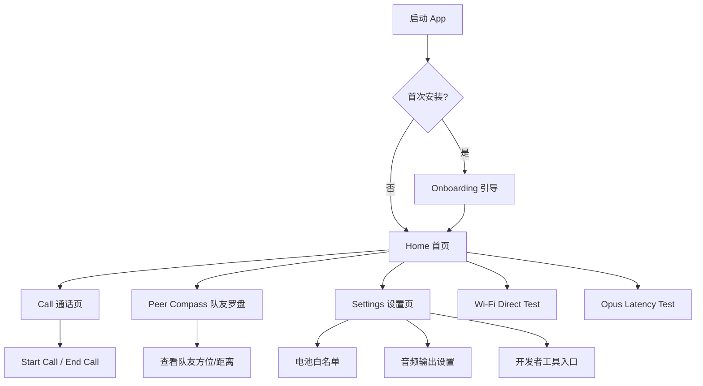

# OffGrid 信息架构与页面流程

> 设计文档 v1.0
> 阶段：M3.5 UI/UX 设计冲刺

---

## 1. 用户目标

| 用户目标 | 对应页面/功能 |
|----------|---------------|
| 快速发起或加入一次语音通话 | Home → Call |
| 查看队友方位与距离 | Home → Peer Compass |
| 管理权限、电池白名单、音频输出 | Home → Settings |
| 首次安装时完成必要授权与引导 | Onboarding Flow |
| 开发者调试 Wi-Fi Direct / Opus | Home → Dev Tools (Wi-Fi Direct Test / Opus Latency Test) |

---

## 2. 页面清单

| 页面 | 英文标识 | 类型 | 说明 |
|------|----------|------|------|
| 引导页 | Onboarding | 流程 | 首次启动时的权限、Wi-Fi Direct、电池白名单引导 |
| 首页 | Home | 主页面 | 状态概览、快捷入口、能力提示、电池白名单入口 |
| 通话页 | Call | 主页面 | 语音通话控制、邻居列表、位置状态 |
| 队友罗盘页 | Peer Compass | 主页面 | 罗盘可视化 + 队友列表 |
| 设置页 | Settings | 主页面 | 权限、电池白名单、音频路由、关于、开发者工具入口 |
| Wi-Fi Direct 测试 | Wi-Fi Direct Test | 开发者工具 | 现有 Activity，保留用于底层调试 |
| Opus 延迟测试 | Opus Latency Test | 开发者工具 | 现有 Activity，保留用于音频调试 |

---

## 3. 页面流程图



---

## 4. 导航结构

### 方案：底部导航栏（Bottom Navigation）

为降低用户在通话、罗盘、设置之间的切换成本，首页之后的主流程采用底部导航栏：

```
┌─────────────────────────────────────────┐
│              Home                       │
├─────────────────────────────────────────┤
│                                         │
│              [Content]                  │
│                                         │
├──────────┬──────────┬──────────┬────────┤
│  Home    │  Call    │  Peers   │Settings│
│  🏠      │  📞      │  🧭      │  ⚙️    │
└──────────┴──────────┴──────────┴────────┘
```

- **Home**：状态卡片、快捷操作、电池优化提示。
- **Call**：语音控制与邻居/位置状态。
- **Peers**：罗盘可视化。
- **Settings**：配置与关于。

开发者工具（Wi-Fi Direct Test / Opus Latency Test）入口移至 Settings 底部，避免普通用户误触。

---

## 5. 状态与空态

| 页面 | 正常态 | 空态 | 错误态 |
|------|--------|------|--------|
| Home | 显示能力状态、快捷按钮 | 无 | 电池优化提示 |
| Call | 显示通话中、邻居列表 | 未开始通话：显示「Ready」 | 音频引擎启动失败 |
| Peer Compass | 显示罗盘与队友标记 | 无队友：显示「Waiting for peer locations」 | GPS 未定位 |
| Settings | 显示配置项 | 无 | 权限被拒绝提示 |

---

## 6. 关键交互原则

- **一键操作**：核心动作（Start Call、End Call、Open Compass）在首屏即可触达。
- **状态可见**：通话状态、邻居数量、电池优化状态使用颜色卡片直观展示。
- **容错引导**：缺少权限或电池优化未授权时，提供可点击的引导卡片。
- **户外可读**：所有文本与图标在强光下保持高对比度，字体不小于 bodyLarge。
