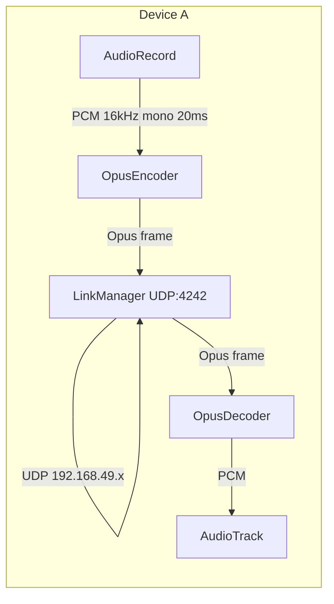

# M2 MVP 直连语音管道

> 文档版本：v1.1
> 目标：在 M1 验证的基础上，实现「麦克风 → Opus → UDP → 对端 UDP → Opus → 扬声器」的完整 MVP 语音管道。

---

## 1. 设计概览

- **AudioEngine**：封装 `AudioRecord`、Opus 编解码、`AudioTrack`，运行在独立音频线程。
- **LinkManager**：UDP socket，绑定 4242 端口，通过 192.168.49.255 广播 HELLO 发现对端，随后单播收发 Opus 帧。
- **VoiceService**：前台服务，持有 AudioEngine 与 LinkManager，将两者串联；同时提供可停止服务的通知。
- **CallScreen / CallViewModel**：UI 入口，请求必要权限，观察 `VoiceStateHolder` 中的运行状态与对端 IP。

---

## 2. 关键实现

### 2.1 AudioEngine

- 采样率：16 kHz，单声道，20 ms 帧（320 samples）
- 编码目标：24 kbps，VOIP 模式，complexity 5
- 线程优先级：`THREAD_PRIORITY_URGENT_AUDIO`
- 对外接口：
  - `start()`：检查 `RECORD_AUDIO` 权限并启动采集线程，初始化成功才返回 `true`
  - `stop()`：停止线程并释放资源
  - `setOnEncodedFrame(listener)`：每帧编码完成后回调
  - `playPacket(opusFrame, length)`：将对端收到的 Opus 帧解码并写入 `AudioTrack`
- **稳定性修复**：通过反射校验 `OpusEncoder` / `OpusDecoder` 的 native `address` 非零，避免 init 失败后 `opus_decode` 空指针崩溃。

### 2.2 LinkManager

- 端口：`4242`
- 发现协议：`OFFGRID_HELLO` 广播，每 2 秒一次
- 收到非 HELLO 数据包时，回调 `onPacket(data, length, sender)`
- 发现对端后记录 `peerAddress`，后续发送改为单播；对端 8 秒无响应则清除并回调 `onPeerDisconnected`
- 未收到对端时，发送目标为广播地址（192.168.49.255）
- **稳定性修复**：
  - 使用 `ScheduledExecutorService` 替代 `Thread.sleep` 循环，避免 `InterruptedException` 导致崩溃
  - 移除 `start()` 中的主线程 `Thread.sleep(200)`
  - 过滤本机地址与回环地址，防止 GO 收到自身 HELLO 后将 `peerAddress` 设置为自己

### 2.3 VoiceService

- 前台服务类型：`foregroundServiceType="microphone"`
- 所需权限：
  - `RECORD_AUDIO`
  - `FOREGROUND_SERVICE`
  - `FOREGROUND_SERVICE_MICROPHONE`
  - `POST_NOTIFICATIONS`（Android 13+）
- 服务生命周期：
  1. `startForeground()` 并显示通知
  2. 启动 AudioEngine + LinkManager
  3. 编码帧通过 LinkManager 发送
  4. 收到对端帧后通过 AudioEngine 播放
  5. 点击通知「停止」或 UI「End Call」时释放资源

### 2.4 UI 与导航

- `MainActivity` 使用 Jetpack Navigation Compose
- 首页提供三个入口：
  - **Start Direct Call** → `CallScreen`
  - **Wi-Fi Direct Test** → `WifiDirectTestActivity`
  - **Opus Latency Test** → `OpusLatencyTestActivity`
- `CallScreen` 请求权限并显示服务状态 / 对端 IP

---

## 3. 测试方法

### 3.1 单机服务启动测试

1. 安装并启动 App。
2. 进入 `CallScreen`，点击 **Start Call**。
3. 允许通知权限（如首次运行，还会请求 RECORD_AUDIO / NEARBY_WIFI_DEVICES / LOCATION）。
4. 验证：
   - 通知栏出现「OffGrid 语音通话中」。
   - logcat 无崩溃。
   - 界面显示 `Voice service running`。

### 3.2 双机语音通话测试（MVP 手动建组流程）

由于当前目标机型（一加 11、华为/荣耀）在 Wi-Fi Direct 连接时会弹出系统 WPS/邀请对话框，MVP 暂采用「先建组、后通话」的手动流程：

1. 在两台手机上分别打开 **Wi-Fi Direct Test**。
2. 设备 A 点击 **Create Group** 成为 Group Owner。
3. 设备 B 点击 **Discover** → **List Peers**，找到设备 A 后点击 **Connect**。
4. 在设备 A 的系统弹窗中点击**接受**。
5. 等待两台设备分配到 192.168.49.x 地址。
6. 返回 App 首页，进入 **Start Direct Call**，两台设备分别点击 **Start Call**。
7. 等待 `Peer: 192.168.49.x` 出现后，进行双向通话。

> 注：M3 阶段将研究如何绕过或自动化系统配对流程（如使用 `WifiNetworkSpecifier` 以 Passphrase 连接 GO 的 SoftAP）。

---

## 4. 测试结果

| 测试项 | 设备 | 结果 | 说明 |
|--------|------|------|------|
| 工程编译 | - | ✅ 通过 | `./gradlew clean build` 成功 |
| 服务启动 / 前台通知 | 一加 11 / 华为 | ✅ 通过 | 通知栏正常显示，无崩溃 |
| AudioEngine 初始化 | 一加 11 / 华为 | ✅ 通过 | 采集/编码线程启动，native handle 校验通过 |
| LinkManager 初始化 | 一加 11 / 华为 | ✅ 通过 | UDP socket 绑定 4242，HELLO 广播正常 |
| 双机 UDP 发现 | 一加 11 ↔ 华为 | ✅ 通过 | 一加 11 作为 GO（192.168.49.1），华为作为 Client（192.168.49.230），双向均发现对端 IP |
| 双机语音通话 | 一加 11 ↔ 华为 | ✅ 通过 | 双向通话声音正常，可听清对方语音；延迟体感较低（未用仪器精确测量） |

---

## 5. 已知问题与下一步

1. **Wi-Fi Direct 系统配对弹窗**：
   - 当 Client 发起 `connect()` 时，Group Owner 会弹出系统邀请对话框，需用户手动接受。
   - 方案：M3 评估使用 SoftAP + `WifiNetworkSpecifier` 的免弹窗连接，或引导用户在系统设置中预配对。

2. **UDP 广播可靠性**：
   - 部分厂商可能限制 P2P 接口上的广播。
   - 方案：在 GO 上通过 `requestGroupInfo` 获取 Client 列表并单播，或改用多播地址。

3. **arm64 原生库缺失**：
   - 与 M1-T4 相同，`opuscodec` 未提供 `arm64-v8a`，长期需替换为自编译 libopus + JNI。

4. **延迟优化**：
   - 当前 AudioTrack 流式写入存在偶发 100+ ms 阻塞（见 `docs/M1_OPUS_LATENCY_TEST.md`）。
   - 方案：M2 后续迭代尝试 AAudio 或 OpenSL ES 低延迟路径。

---

## 6. 相关文件

- `app/src/main/java/com/offgrid/app/audio/AudioEngine.kt`
- `app/src/main/java/com/offgrid/app/link/LinkManager.kt`
- `app/src/main/java/com/offgrid/app/service/VoiceService.kt`
- `app/src/main/java/com/offgrid/app/service/VoiceState.kt`
- `app/src/main/java/com/offgrid/app/ui/screens/CallScreen.kt`
- `app/src/main/java/com/offgrid/app/ui/screens/CallViewModel.kt`
- `app/src/main/java/com/offgrid/app/ui/screens/HomeScreen.kt`
- `app/src/main/java/com/offgrid/app/MainActivity.kt`
- `app/src/main/AndroidManifest.xml`
- `app/build.gradle.kts`
